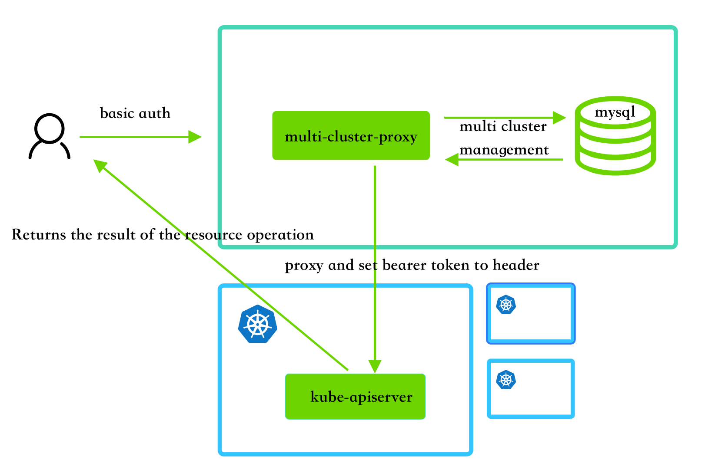

# multi-cluster-proxy

## Architecture

multi-cluster-proxy is a tool for delegating cloud-based capabilities in a simple way，now only basic authentication is used to work，it does two things



1. User management cluster by basic authentication，it can access `/v1/clusters`
2. Use proxy to access cluster resources，it can access `/v1/proxy/clusters/{cluster}/*any`

## Using the step

### Run server

Just run this server in anywhere, You can configure some startup parameters through environment variables

```go
func NewConfigFromEnv() *Config {
	return &Config{
		LogLevel: getEnvOrDefault("LOG_LEVEL", "info"),
		Host:     getEnvOrDefault("HOST", "0.0.0.0"),
		Port:     getEnvOrDefault("PORT", "9001"),
		TlsCert:  getEnvOrDefault("TLS_CERT", ""),
		TlsKey:   getEnvOrDefault("TLS_KEY", ""),
		DataSource: fmt.Sprintf("%s:%s@tcp(%s:%s)/%s",
			getEnvOrDefault("MYSQL_USERNAME", "root"),
			getEnvOrDefault("MYSQL_PASSWORD", "admin"),
			getEnvOrDefault("MYSQL_HOST", "127.0.0.1"),
			getEnvOrDefault("MYSQL_PORT", "3306"),
			getEnvOrDefault("DB_NAME", "dev"),
		),
		BasicAuthUser:     getEnvOrDefault("BASIC_USER", "admin"),
		BasicAuthPassword: getEnvOrDefault("BASIC_PASSWORD", "admin"),
	}
}
```

### Apply the configuration to the managed cluster

```yaml
apiVersion: v1
kind: Namespace
metadata:
  name: multi-cluster-system
---
apiVersion: v1
kind: ServiceAccount
metadata:
  name: multi-cluster
  namespace: multi-cluster-system
---
apiVersion: rbac.authorization.k8s.io/v1
kind: ClusterRoleBinding
metadata:
  name: multi-admin-binding
  namespace: multi-cluster-system
  labels:
    cattle.io/creator: "norman"
subjects:
- kind: ServiceAccount
  name: multi-cluster
  namespace: multi-cluster-system
roleRef:
  kind: ClusterRole
  name: multi-admin
  apiGroup: rbac.authorization.k8s.io
---
apiVersion: rbac.authorization.k8s.io/v1
kind: ClusterRole
metadata:
  name: multi-admin
  labels:
    cattle.io/creator: "norman"
rules:
- apiGroups:
  - '*'
  resources:
  - '*'
  verbs:
  - '*'
- nonResourceURLs:
  - '*'
  verbs:
  - '*'
```

### Get bearer token

Run the following command to obtain the token in the cluster

```bash
kubectl get secret multi-cluster-token-j6rqs -o jsonpath={.data.token} -n multi-cluster-system | base64 -d
```

### Create cluster in multi-clucter-proxy

Access the service registration cluster information based on the obtained token and cluster information,the URL is the access address of the Kube-apiserver

```bash
curl --location --request POST 'localhost:9001/v1/clusters' \
--header 'Authorization: Basic YWRtaW46YWRtaW4=' \
--header 'Content-Type: application/json' \
--data-raw '{
    "id":"3",
    "name":"k8s",
    "url":"https://10.23.5.12:16443",
    "token":"eyJhbGciOiJSUzI1NiIsImtpZCI6ImRubm1RaEdmWmNPTGhsdzUwWDdOTUhadWJvRUdzZ05vcXNrajNsS3VUaHMifQ.eyJpc3MiOiJrdWJlcm5ldGVzL3NlcnZpY2VhY2NvdW50Iiwia3ViZXJuZXRlcy5pby9zZXJ2aWNlYWNjb3VudC9uYW1lc3BhY2UiOiJtdWx0aS1jbHVzdGVyLXN5c3RlbSIsImt1YmVybmV0ZXMuaW8vc2VydmljZWFjY291bnQvc2VjcmV0Lm5hbWUiOiJtdWx0aS1jbHVzdGVyLXRva2VuLWo2cnFzIiwia3ViZXJuZXRlcy5pby9zZXJ2aWNlYWNjb3VudC9zZXJ2aWNlLWFjY291bnQubmFtZSI6Im11bHRpLWNsdXN0ZXIiLCJrdWJlcm5ldGVzLmlvL3NlcnZpY2VhY2NvdW50L3NlcnZpY2UtYWNjb3VudC51aWQiOiJjYzYwOGQ3Yy05MzhhLTRhZjUtYTU1ZC0xYjlhYmEwMGY1MDciLCJzdWIiOiJzeXN0ZW06c2VydmljZWFjY291bnQ6bXVsdGktY2x1c3Rlci1zeXN0ZW06bXVsdGktY2x1c3RlciJ9.u_NXHR2zr_MWDVc_1kZuH59cNO0D5-I8NzirWqA1VE--9iMBXNQ0SZr4u7jEO62sjZMhpuynWzpwtOcKbtjjgPE64Z7W_OgMd2faJvkdwU-5uhLlGxgrVJW8E_TgXRo_LxsCdYJLPZbPOQ6lDyIYw2aonBkvpZxsJnmEQmDeTKoMuyF9D-zeIVEJBNGZSY9GH4PZtYUor8N1TZS9RcVGwK4IyLlh9oD9evuXqzHM45TDp7_7Wh31kLTxGtS_n18lZgi3Sm5rudoGS3Enn5gY8RbLaNyNo3fAylDitXJ7GhXuFbn0gEGjL2qFalMO4JlHqo4EMsn_lp3UyqyKrF9l0A"
}'
```

### Access Cluster Resource

As shown below, you will get a list of namespaces

```bash
curl --location --request GET 'localhost:9001/v1/proxy/clusters/k8s/api/v1/namespaces' \
--header 'Authorization: Basic YWRtaW46YWRtaW4='
```


